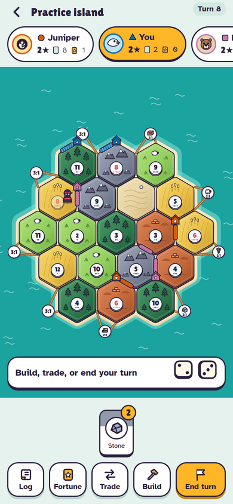
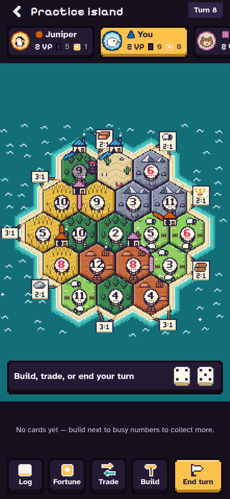
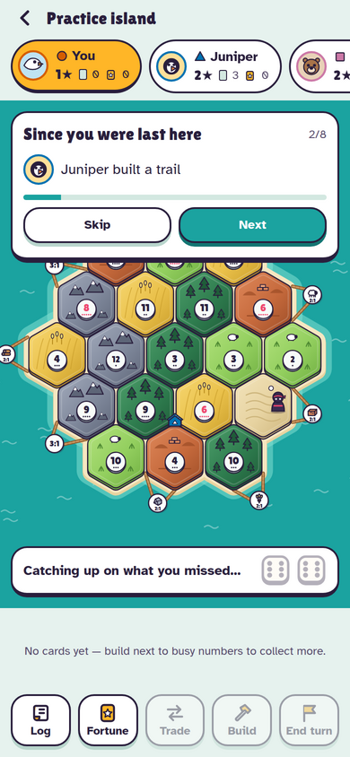
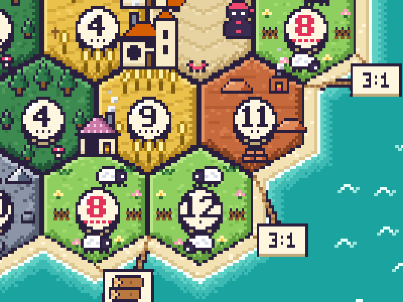
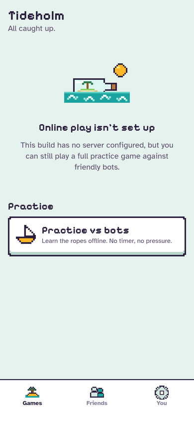
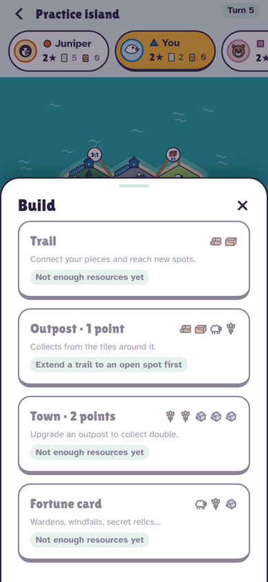
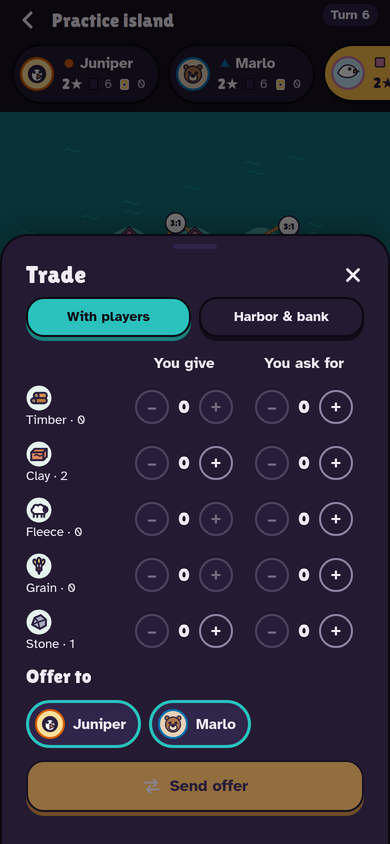

# Tideholm

An asynchronous hex-island trading and building game for 3–4 friends. Settle a little island
one unhurried turn at a time: games can last days, and the app nudges you when it's your move.

<p>
  
  
  
</p>
<p>
  
</p>
<p>
  
  
  
</p>

The look is **16-bit arcade**: the island is rasterized into pixel-art tiles on one shared grid.
Sheep graze and wander, wheat sways in passing gusts, chimneys and kilns smoke, towns fly
pennants, a crab patrols the dunes, and waves and gulls drift across the sea. All of it runs
as stepped 6 fps animation and is frozen under reduced motion. Menus use notched pixel panels
and a pixel display font, while body text stays highly legible.

- **Plan** (data model, action/event schema, screen map): [`docs/PLAN.md`](docs/PLAN.md)
- **Design system** (palette, type, depth, motion, the v1 → v2 critique): [`docs/DESIGN.md`](docs/DESIGN.md)

## What's in the box

```
packages/engine   Pure, deterministic TypeScript rules engine + heuristic bot (72 tests)
supabase/         Postgres schema + RLS + RPCs, Edge Functions (game-start/action/state/tick)
apps/mobile       Expo (React Native) app — Expo Router, SVG board, Reanimated
scripts/          simulate.ts (bots, simulated online players, end-to-end selftest), sync-engine.mjs
```

### How the pieces fit

- **The server is authoritative.** Clients send `{ gameId, action }` to `game-action`. The function
  resolves your seat from your JWT (never from the request), replays the game from the latest
  snapshot plus the action log, validates the action with the engine, and commits it atomically
  (`commit_game_action`). A unique `(game_id, seq)` key handles two players acting at once:
  the loser re-validates against the fresh state and retries.
- **Event sourced.** Each game is an append-only `game_actions` log plus a snapshot every 20
  actions. Replaying is deterministic because the RNG state lives inside the game state.
- **Hidden information never leaves the server.** `game_actions` and `game_snapshots` have no
  client RLS policies. Clients only receive `redactState(state, seat)`, a view with
  opponents' hands, Fortune cards, the deck order and the RNG removed. Private events such as
  steals and card draws are stored once per viewer, already redacted, and Realtime delivers them
  through RLS. `npm run simulate -- --online --selftest` checks for leaks after a full game.
- **"Since you were last here"** comes from the log: events with `seq > last_seen_seq` play back
  as a captioned replay, with pieces dropping onto the board in order.
- **Practice mode** runs the same engine on-device with bots in the other seats, so the app is
  fully playable without a backend.

## Decisions I made (no clarifying questions were needed)

| Topic | Decision |
| --- | --- |
| Title & vocabulary | **Tideholm**: Outpost/Town/Trail, Raider, Fortune cards (Warden, Trailblazer, Windfall, Embargo, Relic), Longest Trail, Grand Watch, Timber/Clay/Fleece/Grain/Stone. |
| Stack | Expo SDK 57 + Expo Router, Supabase (Postgres, Realtime, Auth, Edge Functions), npm workspaces. |
| Async trading | Every trade must include the active player (the classic rule). Offers stay open until answered, withdrawn, or that turn ends. Non-active players can send counter-offers to the active player. Offers also show up as push notifications. |
| Discards on a 7 | Everyone who owes cards discards in parallel, and the turn resumes when the last discard lands. |
| Turn timer | Off / 24h / 48h / 72h. When it expires, `game-tick` applies a `timeout` that makes safe random choices (setup placement, discards, Raider) and passes the turn. |
| Longest Trail ties | The holder keeps it on a tie. If the holder's trail is cut and several others tie for the lead, nobody holds it. |
| Bank shortage | If the bank can't pay every claim on a resource, nobody gets it, unless only one player is owed, who gets whatever is left. |
| Winning | Checked after every action, but only for the player whose turn it is. Hidden Relics count, and are revealed in the `gameWon` event. |
| Player count | Lobbies need 3–4 players (`MIN_PLAYERS`, default 3). The engine supports 2 for testing. |
| Email sign-in | One-time 6-digit codes (`signInWithOtp` + `verifyOtp`), so no deep-link round trip is needed. |
| Sound | Off by default. The effects are synthesized originals in `apps/mobile/assets/sounds`. |

## Setup

Prerequisites: Node 22+, the [Supabase CLI](https://supabase.com/docs/guides/cli), and Docker
(for `supabase start`). Deno 2 is optional and only needed for the Docker-free function server.

```bash
npm install
npm test                 # engine unit tests (setup order, 7s, longest trail, harbors, wins, redaction, fuzz…)
npm run typecheck        # engine + app
```

### Offline only (no backend)

```bash
cd apps/mobile && npx expo start     # leave EXPO_PUBLIC_SUPABASE_* unset → Practice mode
```

### Local backend

```bash
supabase start                         # applies supabase/migrations
supabase status                        # copy API URL + anon key + service role key
npm run sync-engine                    # copies packages/engine into supabase/functions/_shared/engine
supabase functions serve               # serves game-start / game-action / game-state / game-tick
```

If the Supabase edge runtime isn't available (for example behind a TLS-intercepting proxy), you can
run all functions in a single Deno process instead:

```bash
cat > .env.functions <<EOF
SUPABASE_URL=http://127.0.0.1:54321
SUPABASE_ANON_KEY=<anon key>
SUPABASE_SERVICE_ROLE_KEY=<service role key>
CRON_SECRET=local-cron-secret
EOF
npm run sync-engine
deno run -A --env-file=.env.functions supabase/functions/dev-server.ts   # → http://127.0.0.1:54399/functions/v1
```

Then point the app at it:

```bash
cp apps/mobile/.env.example apps/mobile/.env.local   # fill in the values below
cd apps/mobile && npx expo start
```

Email codes from the local stack appear in Mailpit at http://127.0.0.1:54324.

### Environment variables

| Where | Variable | Purpose |
| --- | --- | --- |
| App | `EXPO_PUBLIC_SUPABASE_URL` | Supabase project URL. Leave unset for offline-only builds. |
| App | `EXPO_PUBLIC_SUPABASE_ANON_KEY` | Public anon key. |
| App | `EXPO_PUBLIC_FUNCTIONS_URL` | Optional override for the functions base URL (e.g. the Deno dev server). |
| App | `EXPO_PUBLIC_INVITE_HOST` | Host for public invite links (`https://<host>/invite/<code>`). Without it, links use `tideholm://`. |
| Functions | `SUPABASE_URL`, `SUPABASE_ANON_KEY`, `SUPABASE_SERVICE_ROLE_KEY` | Provided automatically on hosted Supabase. |
| Functions | `CRON_SECRET` | Shared secret the scheduler sends to `game-tick`. |
| Functions | `EXPO_ACCESS_TOKEN` | Optional. Expo push access token, if enhanced push security is on. |
| Functions | `MIN_PLAYERS` | Minimum seats to start a game (default 3). |
| Scripts | `SUPABASE_URL`, `SUPABASE_ANON_KEY`, `FUNCTIONS_URL` | Used by `npm run simulate -- --online`. |

### Single-page web build (practice only)

The offline practice game also ships as one self-contained HTML page, with the bundle and
assets inlined. It runs on any phone browser with no backend:

```bash
cd apps/mobile && npx expo export --clear --platform web --output-dir /tmp/tideholm-web   # EXPO_PUBLIC_SUPABASE_* unset
cd ../.. && node scripts/build-web-single.mjs /tmp/tideholm-web dist/tideholm.html
```

If browser storage is blocked (private mode, sandboxed frames), the game keeps running from
memory for the session.

## Running two simulated players locally

The simulator signs in two bot accounts (`sim_tide`, `sim_ember`) on your local backend. They
accept friend requests and game invites, tap Ready, and play whenever it's their turn. They use
the same redacted views and Edge Functions as a real client.

```bash
export SUPABASE_ANON_KEY=<anon key>               # from `supabase status`
# export FUNCTIONS_URL=http://127.0.0.1:54399/functions/v1   # if using the Deno dev server
npm run simulate -- --online --friend <your_username>
```

1. Sign in to the app (simulator or device) and pick a username.
2. Run the command above. Both sims send you friend requests; accept them on the Friends tab.
   You can also add `sim_tide` and `sim_ember` yourself, and they accept automatically.
3. Tap **New game**, pick both sims, choose a timer, then **Create lobby** → **Launch the boats**.
4. Play your turns. The sims respond within a couple of seconds, and Realtime updates your board.

Other modes:

```bash
npm run simulate                                   # offline: bots play a full game, prints the result
npm run simulate -- --online --selftest            # 3 sims play an entire game through the server + leak check
```

To test the turn timer, set a game's `turn_deadline` in the past, then
`curl -X POST <functions-url>/game-tick -H "x-cron-secret: $CRON_SECRET"`.

## Deploying

```bash
supabase link --project-ref <ref>
supabase db push
supabase secrets set CRON_SECRET=<random> MIN_PLAYERS=3
npm run functions:deploy                           # syncs the engine, then deploys all functions
```

Then run `supabase/cron.sql` once in the SQL editor to schedule `game-tick` every 5 minutes. Enable
the Apple and Google providers under Auth, and add `tideholm://auth-callback` as a redirect URL.
Build the app with EAS (`eas build`). Push notifications and Sign in with Apple need a development
build; Expo Go can't do either.

## Testing

- `packages/engine/test`: 72 tests covering topology, board generation (no adjacent 6/8, harbor
  spacing), setup snake order and second-outpost resources, production and bank shortage, 7s
  (discard thresholds, out-of-turn discards, Raider moves and steals), building rules (distance,
  connectivity, blocking by opponent buildings, piece limits), Longest Trail (loops, forks, cuts,
  ties, set-aside), Grand Watch, Fortune card timing, harbors, persistent trades, win conditions
  (own turn only, hidden Relics), redaction, timeouts, deterministic replay, and 24 full bot games
  checked for invariants (resource conservation, piece counts).
- `npm run simulate -- --online --selftest`: a full game through the real backend.
- CI (`.github/workflows/ci.yml`) runs the tests, the typechecks (including `deno check` for the
  functions) and an offline bot game.

## What's left to ship

**Store & brand**
- App Store and Play listing assets: screenshots per device size, preview video, descriptions,
  keywords, age rating, privacy nutrition labels and Data safety form
- Final icon review at small sizes, an Android monochrome icon, and a splash on brand illustration
- A trademark search for "Tideholm", plus a domain and universal links (`apple-app-site-association`,
  `assetlinks.json`) for `https://<host>/invite/*`

**Credentials & infrastructure**
- APNs key and FCM credentials uploaded to EAS, an EAS project ID in `app.json`, and an
  `EXPO_ACCESS_TOKEN`
- Apple Services ID and key for Sign in with Apple, and Google OAuth client IDs (iOS, Android, web)
- An email provider (SMTP) for OTP codes, with branded templates
- Production `CRON_SECRET`, the scheduled `game-tick`, and monitoring and alerting on function errors
- Handling of Expo push receipts, to prune dead tokens

**Trust & safety**
- Report and block for users (block should also hide them from search and invites)
- Username moderation (profanity and impersonation filter, reserved names) and a way to rename
- Admin tools: look up a game, view its action log, abandon or repair it, and ban accounts
- Account deletion in the app (required by the App Store) and a data export

**Product polish**
- Resign/abandon for active games, and handling a player who leaves mid-game
- In-game chat or emotes (moderated)
- A first-time tutorial overlay, and a rules reference screen
- Localization, and a full VoiceOver/TalkBack pass on the board (each target is already labeled)
- Optional "nudge" push to the player whose turn it is
- An opt-in analytics and crash reporting SDK

**Engineering**
- Rate limiting on `game-action`, and pruning old `game_events` for finished games
- A Detox/Maestro end-to-end suite on device
- Snapshot compaction and archiving finished games to cold storage
